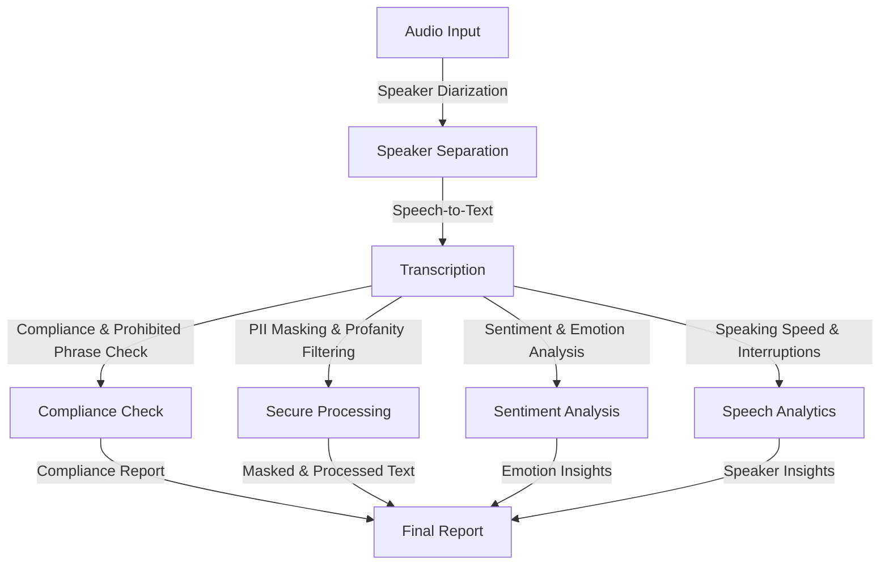

# Project Architecture  

This document describes the architecture of the **Customer Service Assistant** system.  

## Overview  

The system is designed to process real-time customer service calls, transcribe them into text, check for compliance, mask sensitive information, analyze sentiment, and evaluate speaking patterns. The system is modular, with each component focused on a specific task to ensure scalability and maintainability.

---

## System Workflow  

The following diagram illustrates the flow of data from audio input to the final report:

